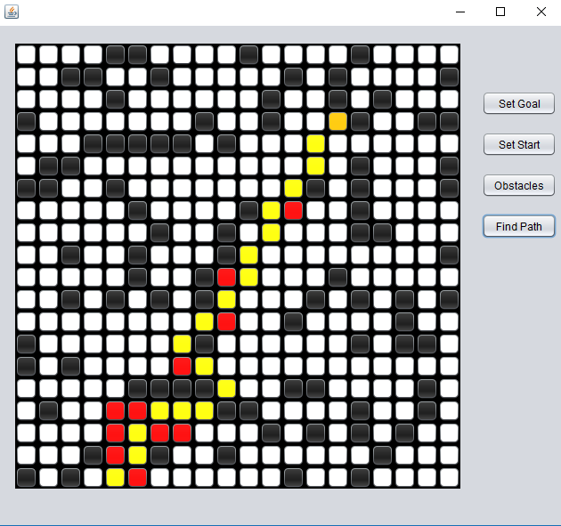

# Shortest-Path-with-A-Star-Algorithm

Directory Structure

- 📂 __Code Files (java)__
  - 📄 [AI.java](Code Files (java)/AI.java)
  - 📄 [Cord.java](Code Files (java)/Cord.java)
  - 📄 [Node.java](Code Files (java)/Node.java)
  - 📄 [RoutePlanner.form](Code Files (java)/RoutePlanner.form)
  - 📄 [RoutePlanner.java](Code Files (java)/RoutePlanner.java)
- 📂 __Complete Project__
- 📂 __build__
  - 📂 __classes__
    - 📂 __ai__
      - 📄 [AI.class](build/classes/ai/AI.class)
      - 📄 [Cord.class](build/classes/ai/Cord.class)
      - 📄 [Node.class](build/classes/ai/Node.class)
      - 📄 [RoutePlanner$1.class](build/classes/ai/RoutePlanner%241.class)
      - 📄 [RoutePlanner$2.class](build/classes/ai/RoutePlanner%242.class)
      - 📄 [RoutePlanner$3.class](build/classes/ai/RoutePlanner%243.class)
      - 📄 [RoutePlanner$4.class](build/classes/ai/RoutePlanner%244.class)
      - 📄 [RoutePlanner$5.class](build/classes/ai/RoutePlanner%245.class)
      - 📄 [RoutePlanner$MouseHandler.class](build/classes/ai/RoutePlanner%24MouseHandler.class)
      - 📄 [RoutePlanner.class](build/classes/ai/RoutePlanner.class)
      - 📄 [RoutePlanner.form](build/classes/ai/RoutePlanner.form)
- 📄 [build.xml](build.xml)
- 📄 [l.md](l.md)
- 📄 [list.md](list.md)
- 📄 [manifest.mf](manifest.mf)
- 📂 __nbproject__
  - 📄 [build\-impl.xml](nbproject/build-impl.xml)
  - 📄 [genfiles.properties](nbproject/genfiles.properties)
  - 📂 __private__
    - 📄 [private.properties](nbproject/private/private.properties)
    - 📄 [private.xml](nbproject/private/private.xml)
  - 📄 [project.properties](nbproject/project.properties)
  - 📄 [project.xml](nbproject/project.xml)
- 📄 [out.doc](out.doc)
- 📄 [output.txt](output.txt)
- 📂 __src__
  - 📂 __ai__
    - 📄 [AI.java](src/ai/AI.java)
    - 📄 [Cord.java](src/ai/Cord.java)
    - 📄 [Node.java](src/ai/Node.java)
    - 📄 [RoutePlanner.form](src/ai/RoutePlanner.form)
    - 📄 [RoutePlanner.java](src/ai/RoutePlanner.java)
- 📂 __test__

